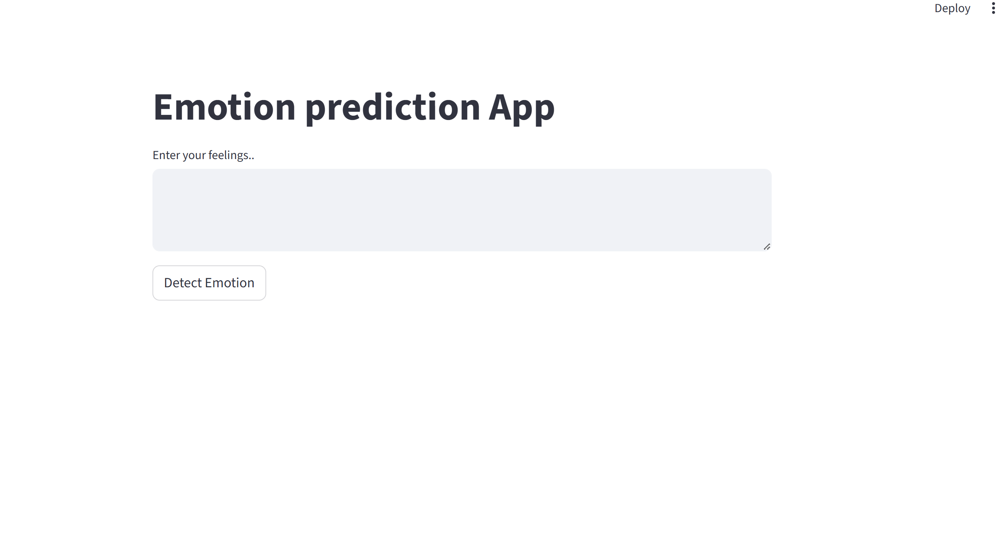

# 😊 Emotion Detection using TF-IDF + Logistic Regression

A machine learning project to classify text into emotions using **TF-IDF Vectorization** and **Logistic Regression** with hyperparameter tuning.

---

## 📊 Project Workflow

- **Data Cleaning:**
  - Removed punctuation, special characters, and noise  
  - Converted text to lowercase   

- **Exploratory Data Analysis (EDA):**
  - Analyzed emotion class distribution  
  - Visualized common words and patterns  
  - Checked text length variations  

- **Text Preprocessing:**
  - Tokenization  
  - Stopword removal  
  

- **Feature Engineering:**
  - Used **TF-IDF Vectorizer** to convert text into numerical features  
  - Captured importance of words across documents  

- **Model Comparison:**
  - Evaluated models using:
    - Accuracy   

- **Final Model: Logistic Regression**
  - Applied **GridSearchCV** for hyperparameter tuning  

  **Tuned parameters:**
  - `C` (regularization strength)  
  - `penalty` (`l1`, `l2`)  
  - `solver` (`liblinear`, `saga`, etc.)  

  - Selected best model based on cross-validation accuracy  

---

## 🌐 Try It Online

[Open the Live App](https://your-app-link/)

---

## 📈 Model Performance

- **Accuracy:** ~89.78%  
- **Precision, Recall, F1-Score:** Balanced across emotion classes  
- Effective in capturing contextual sentiment from text  

---

## 🛠️ Tools & Libraries

- Python 3.x  
- Pandas, NumPy  
- Scikit-learn:
  - `TfidfVectorizer`  
  - `LogisticRegression`  
  - `GridSearchCV`    
- Joblib  
- Streamlit  

---

